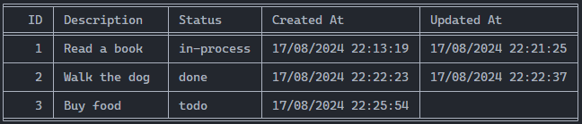
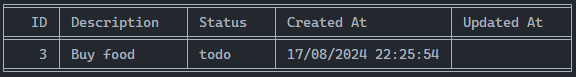

# Task Tracker CLI

Instructions
1. Clone the repository
`git clone https://github.com/Maxis-73/python-task-tracker-cli.git`

2. Create virtual enviroment
If you do not have virtualenv installed, you can install it with the following command: `pip install virtualenv`
Create virtual enviroment: `virtualenv vitual_enviroment_name`

3. Activate virtual enviroment
In Linux and Mac: `source vitual_enviroment_name/bin/activate`
In Windows: `.\vitual_enviroment_name\Scripts\activate`

4. Install dependencies
Run this command: `pip install -r requirements.txt`

Run the project
1. List all tasks: `python src/cli.py tasks`
Output:

2. List by status: `python src/cli.py list argument`
Valid arguments = todo, done, in-process
Example: `python src/cli.py list todo`
Output:

3. Add a new task: `python src/cli.py add "Fix the bug"`
Output: Task added successfully (ID: 4)

4. Delete a task: `python src/cli.py delete ID`
Example: `python src/cli.py delete 1`
Output: Task deleted

5. Update a task: `python src/cli.py ID --task "task"`
Example: `python src/cli.py update 2 --task "Wash the dishes"`
Output: Task with ID 2 has been updated

6. Mark as in-process: `python src/cli.py mark-in-process ID`
Example: `python src/cli.py mark-in-process 2`
Output: The status of the task with ID 2 has been updated

6. Mark as done: `python src/cli.py mark-done ID`
Example: `python src/cli.py mark-done 2`
Output: The status of the task with ID 2 has been updated

[Project Link](https://roadmap.sh/projects/task-tracker)